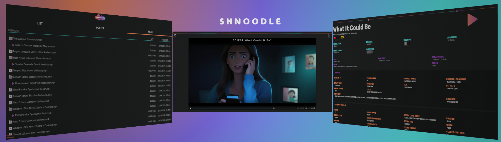
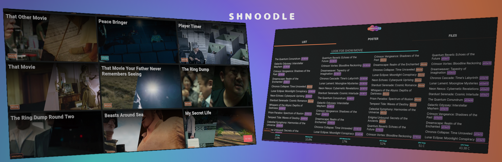

# Shnoodle
in-place , zero overhead, on demand media server / streamer for users who just want to stream local files

<p align="center">
  
</p>

<p align="center">
  
</p>

# How to run
1. clone this repo
2. add your configurations by editing `config/config_linux.json` and reading the [README](config/README.md)
3. (optional) add `blacklist.json` file to the root directory with key words you want filtered. (look at blacklist_example.json and info can be found here [README](config/README.md) )
4. run Shnoodle with `./src/base.py` and you should have output similar to this:
```
Library scan started...
Library scan done. 0.18190884590148926 seconds
Starting httpd on http://192.168.0.24:8000...
```
where `192.168.0.24:8000` is the external ip in the local network other computers in the local network can go to , to stream files

5. ctrl-c to exit the server (all transcoding files will be cleared)

# Requirements

In order to run this you'll need a PC strong enough to transcode media on the fly since each media file you stream will only be transcoded when you stream it

1. Linux machine (windows support may be added when i get around to it)
2. Modern internet browser (tested on Firefox and Chrome)
3. Python3.8+ (most modules are already included if some missing use pip to install them)
4. ffmpeg/ffprobe installed 4.4+ (ffmpeg/ffprobe can be system wide or local. more here [README](config/README.md))

# Features

- Configurable - many options to change/toggle [README](config/README.md)
- Zero overhead - start - runs - exists without leaving anything behind
- Automatic Sanitazations of video filenames - using `blacklist.json` you can have a clear video file name without changing anything on the file itself
- Easy to navigate - 3 ways to explore files: name with search, poster view with shows episodes grouped as seasons, file system view to sort by file-size/modified date
- Streaming Options - by default we stream the video to the browser video player, but if that doesn't work you can copy the stream link and use VLC or mpv , and if that doesn't work you can just download the file to the local PC
- Embedded and external subtitle support - able to let you choose between subtitles that are embedded in the file or subtitles that are separated files (*.srt)
- Auto play: when watching a show (from poster view) the end of the episode will trigger the next one in the season
- GPU support: Use GPU transcoding when streaming media for quicker stream transcoding(only implemented for Nvidia but AMD and Intel have ready boiler-plate code)
- Telemetry: a health check view of the streaming PC (server) , GPU/CPU/Memory temps and utilization (only for Linux for now)
- Dark Mode: the (only) theme to be easy no the eyes

# What's the point
This project emerged when using software like Plex kept asking for a user (and later forcing it) and having a very poor search experience, when all I wanted to do is find files in my local library and stream them to a different PC on the same network

So i started to work on something more simple and to-the-point, my requirements were:
1. Easy to run
2. Easy to search files by name/date/size
3. Always up to date library (simple & quick file scan when it starts)
4. Only running when in use (no background services)
5. Cleans all files it created, leaves nothing behind
6. Zero dependencies, other than the bare minimum listed under [Requirements](#requirements)
7. Extendability, all js files are uncompressed plain ES6+ javascript and python 3 code with documentations so it'll be easy to read and modify + svg only images to be easy to edit
8. No bullshit user account requirements, I only want to stream videos locally

So now it takes ~3 seconds to get it up and running and stream something

# Extendability

Most of the code was kept simple and stored in separate files (some places have a bit of complexity)

Server code is in python with SimpleHTTPServer to make it easy to extend

Front end code is simple css and js with no need to transpile and separated to different
files/modules

All Images (except the spinner) is svg images that can be quickly edited with text editor if it needs to be adjusted and looks great at any resolution


# License
This project is under [MIT license](LICENSE)
And uses a modified uncompressed version of hls.js with it's license
Using Google Fonts Roboto,Rubik,NunitoSans,Inter

# hls.js Changes
added support of subtitle delay when initializing the hls object